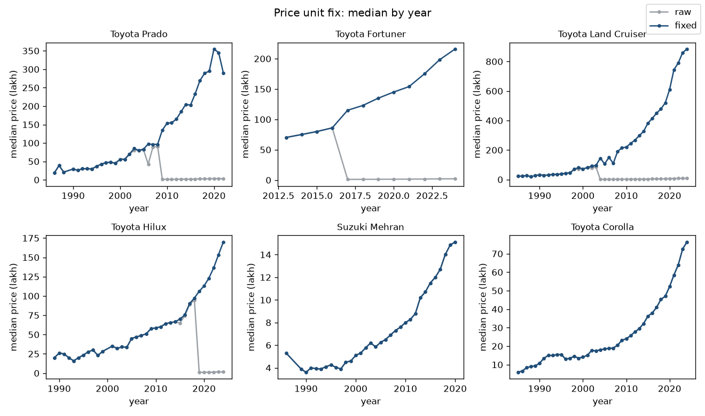
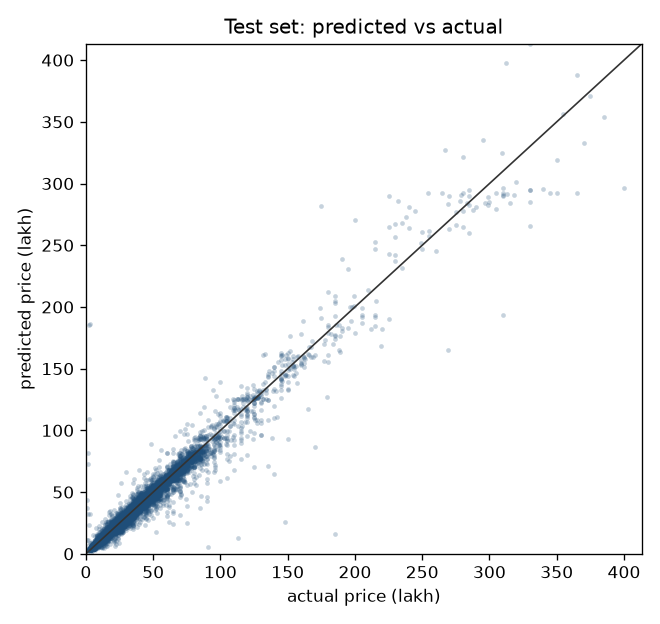
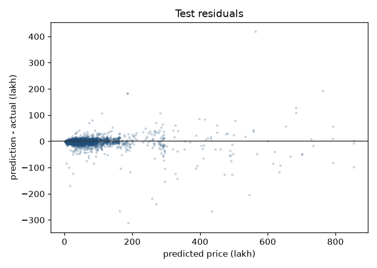
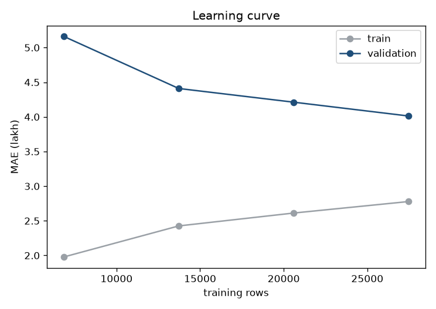
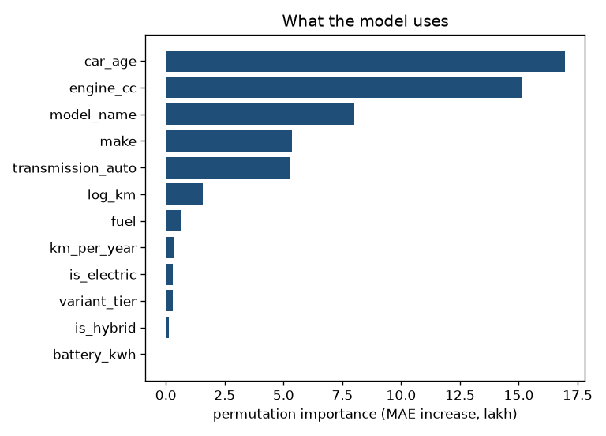
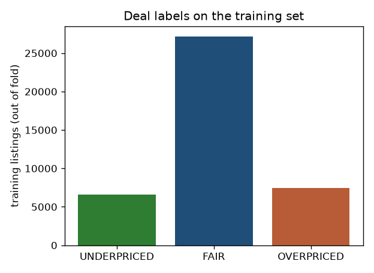
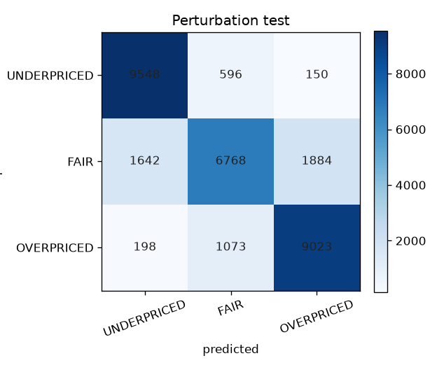
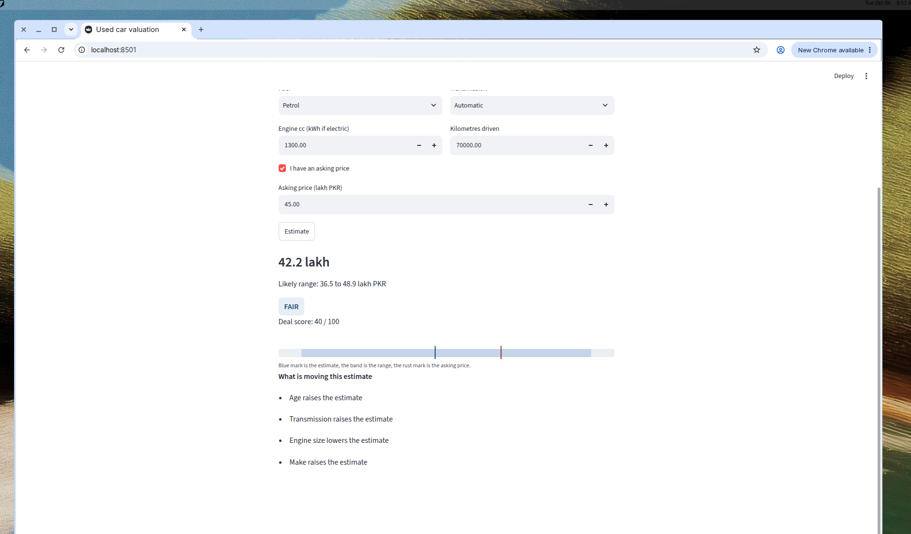
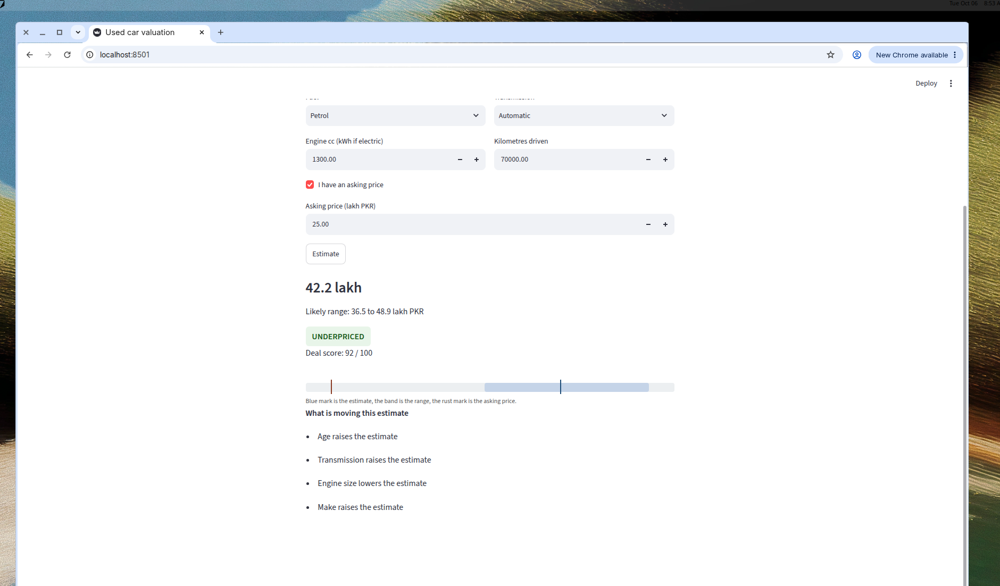
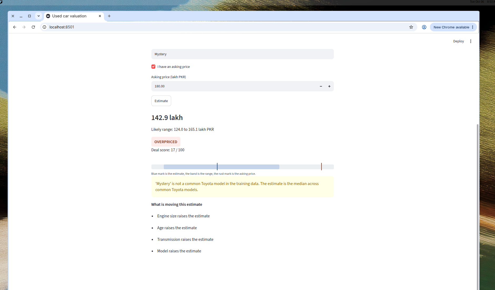

# Pakistan used-car valuation

We wanted a number we could defend for a used car listed on PakWheels: a market value, a range around it, and a plain label for whether the asking price is cheap, fair, or high.

The input is the usual listing fields (make, model, year, engine, fuel, transmission, kilometres, and an optional asking price). The output is an estimate in lakh PKR, a band that should cover the market price about 80% of the time, a deal score from 0 to 100, and one of `UNDERPRICED`, `FAIR`, or `OVERPRICED`.

## Data

The raw file is `data/raw/Pakwheel_car_data.csv`: 60,555 PakWheels listings. Prices are in lakh (1 lakh = 100,000 PKR). After cleaning we keep 51,466 rows. The processed table is `data/processed/cars.csv`.

| Step | Rows |
|---|---|
| Raw listings | 60,555 |
| Missing price (dropped, never imputed) | 999 |
| Exact duplicate rows after that (dropped before the split) | 7,565 |
| Year before 1985 | 460 |
| Price we could not place in either unit | 65 |
| Kept | 51,466 |

There were 8,042 duplicate rows in the raw file once the row index was ignored. Some of those also had a missing price, so the duplicate drop after removing missing prices is 7,565. We drop duplicates before the train/test split so the same listing cannot sit in both sides.

Year is cut at 1985. Older rows are a thin mix of classics, and 460 rows is under 1% of the file. Kilometres that cannot belong to a car of that age (under 500 km on a car older than two years, over 500,000 km, or over 100,000 km per year) are set to missing rather than deleted: 1,613 rows. Engine size below 500 cc or above 8,000 cc is treated as junk. Electric listings that stored kWh instead of cc get a `battery_kwh` feature and a missing `engine_cc`.

### The price unit

This was the cleaning step that mattered. PakWheels shows a price in lakh until it crosses 1 crore, then switches the label to crore. The scrape kept the number on the screen and capped the column at 100. A 2018 Prado at 2.89 is 289 lakh, not 2.89 lakh. A 2012 Mehran at 8 lakh is actually 8 lakh.

For each make and model we treat values at or above 22 as already in lakh (nothing in this market is 22 crore). From those anchors we estimate a year-by-year lakh price. A small reading is converted (multiplied by 100) only when the crore interpretation sits near that estimate, or when the model has already flipped into crore display and the next years continue the same climb. Premium nameplates with no lakh anchors at all (an e-tron, a Taycan) are converted as a group. Readings that are too cheap to be lakh and too far from the peers to be crore are dropped: 65 rows.

We converted 2,373 listings. Budget cars were left alone (zero Suzuki, Daihatsu, FAW, Prince, or United rows converted). A 2018 Fortuner median moves from 1.23 to 123 lakh, a 2018 Prado from 2.89 to 289, a 2022 Land Cruiser from 7.90 to 790. Mehran and Corolla medians do not move.



### Imbalance

Three makes are most of the market: Toyota 32.9%, Suzuki 26.2%, Honda 21.0%. Daihatsu, Nissan, KIA, Hyundai, and Mitsubishi are each under 5%. Fuel is more lopsided: petrol is 87.7% of cleaned rows, hybrid 7.1%, diesel 3.9%, and CNG, electric, and LPG together under 1.5%. After parsing titles we have 500 make-model pairs, and 332 of them have fewer than 20 listings. Those rare levels are collapsed to `Other` inside the training pipeline, fit on the training fold only, so the model still sees the make.

## Model

Target is `log1p` of price in lakh. We predict in log space and invert with `expm1` for every reported number. Features are age (2024 minus year), log kilometres, kilometres per year, engine cc, battery kWh, hybrid and electric flags, automatic transmission, make, model, fuel, and a coarse variant tier (base / mid / high from tokens such as Oriel, VXL, Grande, Z).

Preprocessing sits in a scikit-learn `Pipeline`: median imputation and scaling for the numeric columns, rare-level grouping, then one-hot encoding with unknown levels ignored. The 20% test set is stratified by price quintile (`random_state=42`) and is not used for model choice. On the training set we run 5-fold cross-validation, also stratified by price quintile. Each learner gets a small `RandomizedSearchCV` (up to 4 draws). The comparison below is cross-validated mean absolute error in lakh, mean +/- fold standard deviation.

| Model | CV MAE (lakh) |
|---|---|
| XGBoost | 3.93 +/- 0.08 |
| LightGBM | 4.22 +/- 0.23 |
| CatBoost | 4.38 +/- 0.18 |
| HistGradientBoosting | 4.40 +/- 0.18 |
| Ridge | 6.54 +/- 0.22 |
| Random forest | 7.94 +/- 0.23 |
| Median by make and model | 13.65 +/- 0.22 |

XGBoost won (400 trees, depth 7, learning rate 0.1, subsample 0.85). On the untouched test set:

| Metric | XGBoost | Make-model median |
|---|---|---|
| MAE (lakh) | 3.75 | 13.27 |
| RMSE (lakh) | 11.69 | |
| R2 | 0.955 | 0.586 |
| MAPE | 14.2% | 45.2% |
| Median absolute % error | 6.6% | |
| Within 10% of actual | 65.6% | |
| Within 20% of actual | 87.8% | |





Error is not uniform. Median absolute percentage error is about 5% on mid and premium cars and about 11% on budget cars. Cars under five years old land within 20% of the truth 97% of the time; cars 20 years and older only 65%. Electric cars are a small, noisy slice (34 in the test set, MAE about 45 lakh). Suzuki is the easiest make in absolute error (MAE 1.6 lakh) because those cars are cheap; Toyota's MAE is 4.8 lakh on a much higher price level.

The learning curve is still drifting down at the full training size, and training error sits about 1.2 lakh under validation error. More listings would help. It is not a case of the model memorising the training set and then falling apart.



Permutation importance (MAE increase when a column is shuffled, on a test sample) puts age and engine size first, then model, make, and transmission. Kilometres matter, but much less once age is known. Battery size does nothing useful, which fits a column that is zero for almost every row.



Age and engine size dominate because they separate a 660 cc Mehran from a 2,700 cc Fortuner, and a 20-year-old car from a three-year-old one. Make and model still move the estimate after that, which is why a Prado and a Corolla of the same age do not get the same number.

## Price range

The point model is refit on all training rows. The band does not come from that fit. We take 5-fold out-of-fold predictions on the training set, compute residuals in log price, and keep the 10th and 90th percentiles. Those two offsets are added to a new log prediction and inverted. A log residual is a percentage, so a Land Cruiser gets a wider band in lakh than a Mehran, which matches the residual plot (errors fan out as the price rises).

Out-of-fold coverage of this rule is 80.0%. On the test set it is 80.5%. Mean width is 11.9 lakh, median width 8.9 lakh, and the average width is 31.5% of the actual price. We did not widen or shrink the band after seeing the test coverage.

## Deal score

There is no human label for "this listing is a deal". The score is only a comparison of the asking price to our estimate.

```
score = 100 / (1 + exp(6 * (asking / estimate - 1)))
```

It is 50 when the ask equals the estimate, about 82 at a 25% discount, and about 18 at a 25% premium. Higher is better for the buyer, and the score falls smoothly as the ratio rises.

The label uses both the band and a 10% ratio rule:

- `UNDERPRICED` if the ask is below the band, or below 90% of the estimate
- `OVERPRICED` if the ask is above the band, or above 110% of the estimate
- `FAIR` otherwise

On out-of-fold training predictions the mix is 66% fair, 18% overpriced, 16% underpriced. That is a sensible split, not one class swallowing the data.



To see whether a real mispricing would be caught, we took each test car and shifted its actual price by -25%, 0%, and +25%, and treated those three shifts as underpriced, fair, and overpriced. Accuracy on that set is 82%, macro F1 is 0.82. Recall is 0.93 for the cheap shift, 0.88 for the expensive shift, and 0.66 for the unshifted price. The fair class is the weak one: if the model itself is more than 10% off, an honest asking price is labelled under or over. That is the ratio rule doing what we asked, and it is also a reminder that these labels are relative to the model.



A few checks we actually ran through `predict_car`, asking price in lakh:

| Listing | Ask | Estimate | Range | Label |
|---|---|---|---|---|
| 2018 Corolla GLi, 70,000 km | 45 | 42.2 | 37-49 | FAIR |
| 2015 Fortuner, 90,000 km | 80 | 78.8 | 68-91 | FAIR |
| 2022 Fortuner, 40,000 km | 180 | 167 | 145-193 | FAIR |
| 2018 Prado TX, 60,000 km | 280 | 286 | 248-330 | FAIR |
| 2012 Mehran, 90,000 km | 8 | 8.7 | 7-10 | FAIR |
| 2022 Land Cruiser, 20,000 km | 800 | 695 | 603-802 | OVERPRICED |

The 2015 Fortuner stays under a crore and the 2022 Fortuner does not. That was the point of the unit fix.

## App

The Streamlit form is the same inputs as `predict_car`. For a 2018 Corolla GLi with 70,000 km, an ask of 45 lakh sits inside the band (42.2, range 36.5 to 48.9) and is labelled fair.



The same car at 25 lakh is under the band, so the badge flips to underpriced and the deal score goes to 92. The estimate itself does not move.



A 2022 Fortuner Legender, diesel, 2,700 cc, 40,000 km, is about 167 lakh. That is the crore-to-lakh fix showing up at prediction time: the raw scrape would have made this car look like 1.7 lakh.


If the model name is not one we saw often, we do not invent a row for it. The estimate is the median prediction across the common models of that make, and the page says so.



## How to run

```bash
pip install -r requirements.txt
pip install -e .
python -m carval.train          # refits everything and rewrites models/ and reports/
python -m carval.cli \
  --make Toyota --model Corolla --variant GLi --year 2018 \
  --engine-cc 1300 --transmission Automatic --fuel Petrol \
  --km 70000 --asking-price 45
streamlit run app/streamlit_app.py
pytest
```

The checked-in model is enough for the CLI and the app. Training is only needed if you want to reproduce the metrics. Tests cover the unit fix, kilometre parsing, title parsing, deal-score monotonicity, the label thresholds, and `predict_car`.

`predict_car(make, model, variant, year, engine_cc, transmission, fuel_type, km_driven, asking_price=None)` returns `estimated_price`, `price_low`, `price_high`, `deal_score`, and `verdict`. Year has to be 1985-2024. An unknown make is an error. An unknown model is not: we take the median prediction across the common models of that make and return a warning. Metadata (metrics, features, library versions, training time) is in `models/metadata.json`.

## Limitations

The deal label is not a fact about the listing. It is "cheap or expensive relative to this model". Sellers write asking prices, not transaction prices, and a car can be cheap because something is wrong with it that we never see.

The unit fix is a rule with domain cutoffs, not a second labelled dataset. We checked it on the models where a wrong unit would be obvious (Prado, Fortuner, Land Cruiser, Hilux, Mehran, Corolla) and dropped the rows that stayed ambiguous. A few luxury rows, especially where a new generation jumps in price, could still be off by a lot.

We have no city, registration, or condition. Electric cars and very old cars are thin. Variant text is only a coarse tier. The learning curve says we are not done with data.

## What we would do next

Sold prices, if we can get them, would be a better target than asking prices. A city feature would matter in this market. The electric slice needs its own model or a lot more rows. Quantile gradient boosting would be the thing to compare against the conformal band, not instead of checking coverage.
